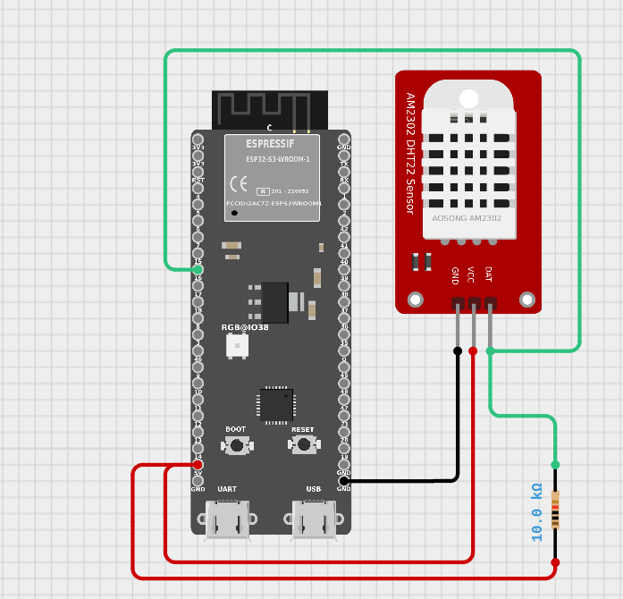

# EcoMonitor ESP

A React Native (Expo) mobile dashboard for monitoring temperature, humidity, and other telemetry data from ESP32 IoT devices. The app features a Grafana-inspired dark UI with real-time simulated telemetry, interactive SVG charts, configurable climate event simulators, and a built-in Arduino sketch viewer for deploying to physical ESP32 hardware.

## Features

- **Live Dashboard** — Real-time temperature, humidity, voltage, WiFi RSSI, and uptime monitoring with animated spectrogram visualization
- **History Charts** — SVG-based area charts with gradient fills for temperature and humidity history, filterable by time range (1h / 6h / 24h / 7d)
- **Telemetry Logs** — Reverse-chronological log viewer with running averages, peak values, and color-coded status badges (NOMINAL, WARM, COLD, HUMID, DRY)
- **Simulation Engine** — Configurable random-walk telemetry generator with adjustable target temperature, humidity, noise level, and telemetry frequency (5s to 5min)
- **Climate Event Simulator** — One-tap anomaly triggers for heatwave and monsoon burst scenarios
- **ESP32 Arduino Code** — Built-in `esp32_dht22_logger.ino` sketch viewer with copy-to-clipboard for flashing real ESP32 + DHT22 hardware
- **Persistent Storage** — Telemetry history and settings cached locally via AsyncStorage
- **Dark UI** — Grafana-inspired dark theme throughout

## Tech Stack

| Layer | Technology |
|-------|-----------|
| Framework | React Native 0.81 with Expo SDK 54 |
| Language | TypeScript 5.9 |
| Charts | react-native-svg (custom SVG area charts) |
| Icons | lucide-react-native |
| Storage | @react-native-async-storage/async-storage |

## Prerequisites

- [Node.js](https://nodejs.org/) (LTS recommended)
- [Expo CLI](https://docs.expo.dev/get-started/installation/) (`npm install -g expo-cli`)
- For physical device testing: [Expo Go](https://expo.dev/go) app on your phone

## Getting Started

1. **Clone the repository:**
   ```bash
   git clone git@github.com:VOYAGER441/Humitidy-and-Temperature-via-esp.git
   cd Humitidy-and-Temperature-via-esp
   ```

2. **Install dependencies:**
   ```bash
   npm install
   ```

3. **Start the development server:**
   ```bash
   npm start
   ```
   Or run directly on a specific platform:
   ```bash
   npm run android   # Android emulator/device
   npm run ios       # iOS simulator/device
   npm run web       # Web browser
   ```

4. **Open in Expo Go** — Scan the QR code displayed in the terminal with your phone.

## Project Structure

```
.
├── App.tsx                      # Root component — tab navigation, simulation engine, state management
├── app.json                     # Expo configuration
├── package.json                 # Dependencies and scripts
├── tsconfig.json                # TypeScript config
├── babel.config.js              # Babel config
└── src/
    ├── types.ts                 # TelemetryReading and SimulationSettings interfaces
    ├── utils.ts                 # Mock data generator and ESP32 Arduino code template
    └── components/
        ├── DashboardTab.tsx     # Live telemetry dashboard with spectrogram
        ├── HistoryTab.tsx       # SVG area charts with time-range filtering
        ├── LogsTab.tsx          # Telemetry log viewer with status badges
        ├── SettingsTab.tsx      # Simulation controls, climate events, code viewer
        └── Icons.tsx            # Custom SVG icon components
```

## Circuit Diagram

<p align="center">
  
</p>

🔧 **[Interactive Circuit Simulation](https://app.cirkitdesigner.com/project/a2f15a32-66b7-4d52-95bb-3ec25d87b8d5)** — Explore and simulate the circuit in CirKit Designer

## ESP32 Hardware Integration

The app includes an Arduino sketch (`esp32_dht22_logger.ino` viewable in the **Config** tab) designed for an **ESP32-WROOM-DA** paired with a **DHT22** sensor. Refer to the circuit diagram above for wiring. To use real hardware:

1. Flash the sketch to your ESP32 using the Arduino IDE or PlatformIO
2. Update `ssid`, `password`, and `serverName` in the sketch to match your WiFi and API endpoint
3. The device will POST JSON telemetry payloads (temperature, humidity, voltage, RSSI, uptime) every 60 seconds

## Scripts

| Command | Description |
|---------|-------------|
| `npm start` | Start the Expo development server |
| `npm run android` | Start on Android |
| `npm run ios` | Start on iOS |
| `npm run web` | Start on web |
| `npm run ts:check` | Run TypeScript type checking |

## License

SPDX-License-Identifier: Apache-2.0